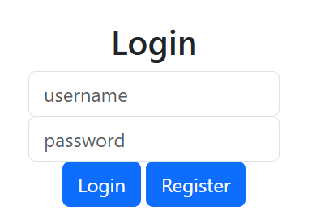
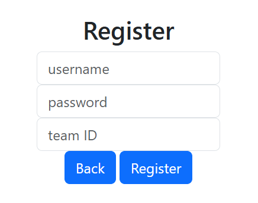
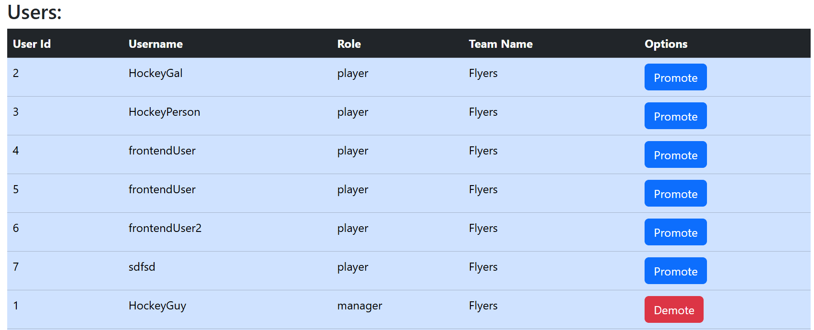
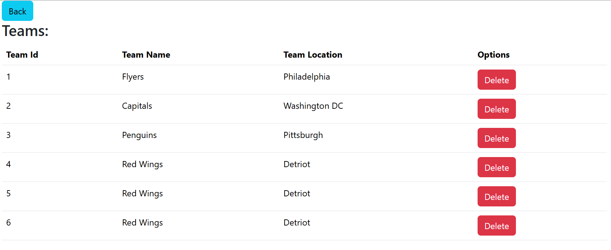

# P1Demo
A Full Stack Application with a PostgreSQL Database, Spring Boot backend, and a React frontend

## Backend Functionalities

- Login, Register, Get all teams, Get all users, Insert team, Insert user, update user password
- Users must log in to do anything besides login or register.
- Only managers can Get all Users

## User Interface, styled with bootstrap

- Login
- 
  

- Register
- 
  

- Get all Users
- 
  

- Get all Teams
- 
  
